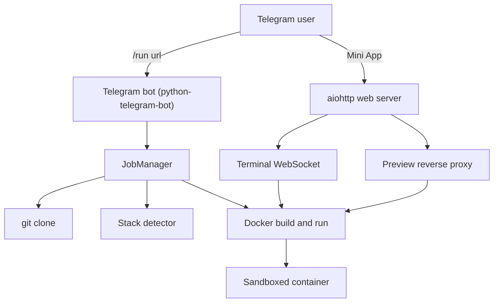
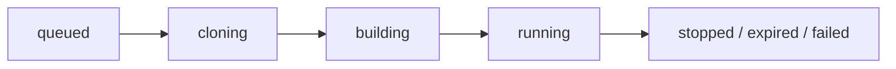

# Telegram GitHub Repo Runner

A self-hosted Telegram bot that takes a GitHub repository, clones it, figures out how to
build and run it, installs the dependencies automatically inside a disposable Docker
sandbox, and gives you back:

- a live **web terminal** into the running container, and
- a **preview link** to the application it started,

both from a **Telegram Mini App**.

It is essentially a tiny self-hosted deployment runner ("send repo, get running app")
driven from Telegram.

> Security first: this tool executes arbitrary code from repositories on your host.
> Read the Security section before exposing it to other people.

## Features

- `/run <github_url> [branch]` clones the repo, detects the stack, builds an image,
  installs dependencies and starts the app in a sandboxed container.
- Automatic detection for Node.js (npm/yarn/pnpm, Next, Vite, CRA, Nuxt), Python
  (Django, Flask, FastAPI, Streamlit, Gradio), Go, Rust, Ruby/Rails, PHP/Laravel,
  Java (Maven/Gradle), static sites and repositories that ship their own `Dockerfile`.
- Per-repo `.tgrunner.yml` override when detection is not enough.
- Telegram Mini App with:
  - new job form and job list,
  - interactive terminal (xterm.js over WebSocket) attached to the container,
  - one-tap preview link, log viewer, and stop button.
- Resource limits per container (memory, CPU, PIDs, no-new-privileges), automatic
  stop after a configurable timeout.
- Access control with `ALLOWED_USER_IDS`, optional repository-owner allowlist, and
  signed Mini App sessions validated with Telegram `initData` HMAC.
- Secrets are redacted from logs and stored messages.

## Architecture



Process flow for one job:



## Repository layout

```text
tgbot/            bot, job manager, detector, docker runner, web server
web/              Telegram Mini App (HTML, CSS, xterm.js)
tests/            unit tests for detector and security
Dockerfile        image for the bot itself
docker-compose.yml
Caddyfile         reverse proxy with automatic HTTPS
```

## Quick start (local, Docker required)

1. Create a bot with [@BotFather](https://t.me/BotFather) and copy the token.

2. Get your numeric Telegram user id (for example from [@userinfobot](https://t.me/userinfobot)).

3. Prepare configuration:

   ```bash
   cp .env.example .env
   python -c "import secrets; print(secrets.token_urlsafe(48))"
   ```

   Set at least `TELEGRAM_BOT_TOKEN`, `SESSION_SECRET` and `ALLOWED_USER_IDS`.

4. Install and run:

   ```bash
   python -m pip install --break-system-packages -r requirements.txt
   python -m tgbot.main
   ```

   The bot needs access to the Docker daemon (`/var/run/docker.sock`).

5. Talk to your bot with `/run https://github.com/owner/repo`.

   Release archives work the same way:

   ```text
   /run https://github.com/owner/repo/releases/download/v1.0/app.zip
   /run https://github.com/owner/repo main 8080
   ```

   If the app needs a specific port, pass it as the last argument. During the
   Docker build the bot reports the current step and an ETA. Use `/cancel <job_id>`
   to abort a queued, building or running job.

   The Mini App terminal is a Linux shell inside the running container. From
   there you can start extra processes, inspect files, or host the app yourself.

## Release archives (zip / tar.gz)

`/run` accepts GitHub release asset URLs and GitHub archive URLs:

```text
https://github.com/owner/repo/releases/download/v1.0/app.zip
https://github.com/owner/repo/archive/refs/tags/v1.0.tar.gz
```

The bot downloads the archive (GitHub hosts only), extracts it with zip-slip
protection, runs the same stack detector as a git clone, and hosts the original
file at `/download/<job_id>`. Telegram users can also use `/download <job_id>`.
Limits are `ARCHIVE_MAX_BYTES` (download) and `ARCHIVE_EXTRACT_MAX_BYTES`
(uncompressed). Private assets need `GITHUB_TOKEN`.

## 24/7 operation, storage and cache

`/info` (and `GET /api/info` in the Mini App) reports disk usage, cache size,
active jobs and cleanup interval.

- Cache directories older than `CACHE_MAX_AGE_SECONDS` are removed every
  `CACHE_CLEANUP_INTERVAL_SECONDS` (both default to 3 hours).
- Jobs left `queued` / `building` / `running` after a crash are marked failed
  on the next start so they cannot block a concurrency slot.
- Set `RESTART_ON_DISK_FULL=true` if a supervisor (systemd, Docker
  `restart: unless-stopped`, Railway) should restart the process when disk
  usage stays at or above `DISK_RESTART_PERCENT` after a cleanup. Leave it
  `false` unless something is restarting the process for you.

## Running without root (rootless Docker or Podman)

The runner only talks to the Docker API, so it works on hosts where you have no
root and no `sudo`: run the Docker daemon (or Podman) in rootless mode under your
own user and point the bot at that socket. The bot never needs to be started as
root.

1. Enable the rootless engine (one time), then note the socket path:

   ```bash
   # Rootless Docker
   systemctl --user enable --now docker
   echo "unix:///run/user/$(id -u)/docker.sock"

   # or rootless Podman
   systemctl --user enable --now podman.socket
   echo "unix:///run/user/$(id -u)/podman/podman.sock"
   ```

   Keep the user session alive for the bot, for example with `loginctl enable-linger "$USER"`.

2. Point the bot at the socket. Add it to `.env` (see `.env.example`):

   ```bash
   DOCKER_HOST=unix:///run/user/1000/docker.sock
   ```

   If `DOCKER_HOST` is left empty the bot auto-detects `/var/run/docker.sock` first
   and then falls back to the rootless Docker/Podman socket of the current user.

3. When the bot itself runs from `docker-compose.yml`, mount that socket instead of
   the system one and let Compose run the container as your user:

   ```bash
   DOCKER_SOCKET=/run/user/1000/docker.sock
   RUN_AS_UID=$(id -u)
   RUN_AS_GID=$(id -g)
   ```

   Both variables live in the same `.env` file that Compose reads. With rootless
   engines the container's `root` is already mapped to your unprivileged host user,
   so `RUN_AS_UID`/`RUN_AS_GID` are only needed when the socket is owned by a
   different UID. On SELinux hosts add the `:z` mount flag to the socket and `data`
   volumes in `docker-compose.yml`.

Notes for rootless setups:

- Job containers publish ports on `127.0.0.1`, which rootless port forwarding
  exposes on the host loopback. Keep `PORT_RANGE_START`/`PORT_RANGE_END` above 1024
  (the defaults are fine).
- Resource limits (`MEM_LIMIT`, `NANO_CPUS`, `PIDS_LIMIT`) are enforced through
  cgroup v2. They work on rootless Docker and Podman when cgroup delegation is
  enabled; otherwise the kernel ignores them and the limits become best-effort.
- If you get "Cannot connect to the Docker daemon", confirm the socket path with
  `docker context ls` (rootless Docker) or `podman info --format '{{.Host.RemoteSocket.Path}}'`
  and set `DOCKER_HOST` accordingly.

## Deployment on a VPS

`docker-compose.yml` runs the bot with `network_mode: host` and mounts the Docker
socket so that containers it creates can publish ports on the host loopback.

```bash
docker compose up -d --build
```

For a rootless deployment set `DOCKER_SOCKET`, `RUN_AS_UID` and `RUN_AS_GID` in
`.env` as described above before running the same command.

Put a TLS reverse proxy in front of the web port. An example `Caddyfile` is included:

```bash
caddy run --config Caddyfile
```

Then set `PUBLIC_URL=https://runner.example.com` in `.env`.

### Preview links

Two modes are supported:

- **Path mode** (default): previews are served at `PUBLIC_URL/preview/<job-id>/`.
  Works with a single domain, but applications that reference absolute asset paths
  (`/assets/...`) may not render correctly through the proxy.
- **Subdomain mode**: set `PREVIEW_BASE_DOMAIN=runner.example.com` and create a
  wildcard DNS record `*.runner.example.com`. Each job then gets
  `https://<job-id>.runner.example.com/`, which works with any application. This
  requires a wildcard TLS certificate (for example via a Caddy DNS challenge).

Telegram requires HTTPS for Mini App buttons, so `PUBLIC_URL` must be `https://...`
for the "Open Mini App" button to appear.

## Bot commands

| Command | Description |
| --- | --- |
| `/run <repo_url\|release_zip_url> [branch] [port]` | Clone or unpack, build and run |
| `/cancel <job_id>` | Cancel a queued, building or running job |
| `/jobs` | List your recent jobs and their status |
| `/status <job_id>` | Details, build step and ETA |
| `/api <job_id>` | API link, uptime, requests and health |
| `/download <job_id>` | Hosted zip/tar of a release job |
| `/info` | Disk, cache, active jobs and runtime |
| `/logs <job_id>` | Recent build and runtime output |
| `/stop <job_id>` | Stop a running job |
| `/open` | Open the Mini App (Linux terminal + preview) |
| `/help` | Show help |

## `.tgrunner.yml` override

Add this file to the root of a repository to bypass auto-detection:

```yaml
base_image: node:22-slim
install:
  - npm ci
build:
  - npm run build
run: npm start
port: 3000
```

## Configuration reference

All variables live in `.env.example`. The important ones:

| Variable | Meaning |
| --- | --- |
| `TELEGRAM_BOT_TOKEN` | BotFather token |
| `PUBLIC_URL` | Public HTTPS URL of this service |
| `ALLOWED_USER_IDS` | Comma-separated Telegram user ids allowed to use the bot |
| `ADMIN_USER_IDS` | Users who can manage any job |
| `ALLOWED_REPO_OWNERS` | Optional allowlist of GitHub owners/orgs |
| `GITHUB_TOKEN` | Needed for private repos and higher rate limits |
| `MAX_CONCURRENT_JOBS` | How many jobs may build/run at once |
| `JOB_TIMEOUT_SECONDS` | Auto-stop running jobs after this time |
| `MEM_LIMIT`, `NANO_CPUS`, `PIDS_LIMIT` | Per-container resource limits |
| `ENABLE_TERMINAL` | Enable or disable the web terminal |
| `PREVIEW_BASE_DOMAIN` | Enables subdomain preview links |
| `DOCKER_HOST` | Docker/Podman daemon socket; auto-detected when empty |
| `DOCKER_SOCKET`, `RUN_AS_UID`, `RUN_AS_GID` | Compose only: socket path and UID/GID for the bot container |
| `ARCHIVE_MAX_BYTES` | Max size of a downloaded release archive |
| `CACHE_CLEANUP_INTERVAL_SECONDS` | How often finished-job cache is cleaned (default 3h) |
| `CACHE_MAX_AGE_SECONDS` | Age after which a cache directory is removed |
| `RESTART_ON_DISK_FULL` | Exit after cleanup if disk is still full (supervisor restarts) |
| `DEV_LOGIN_USER_ID` | Local development only, never on a public deployment |

## Security

Running repositories from the internet is inherently risky. This project takes these
measures, but they are **not** a complete sandbox:

- Each repo runs in its own container with memory, CPU and PID limits,
  `no-new-privileges`, and no access to the host Docker socket.
- Only `github.com` URLs are accepted; an optional owner allowlist can restrict who
  may be run.
- The Mini App API requires a Telegram `initData` HMAC signature or a signed,
  short-lived session token; the bot itself checks `ALLOWED_USER_IDS`.
- Tokens and obvious secrets are redacted from logs and Telegram messages.

Things you must still do yourself:

- Run this on a dedicated host or VM that you are willing to rebuild.
- Keep `ALLOWED_USER_IDS` non-empty. An open bot lets anyone execute code on your host.
- Consider egress firewall rules so containers cannot reach your private network.
- Do not put secrets or production data on the same host.
- Review untrusted repositories before running them; the detector runs whatever the
  repository asks it to run.

This project is intended for running repositories you trust, on infrastructure you own.
Do not use it to run malware, mine cryptocurrency, or attack third parties.

## Limitations

- Detection is heuristic. Repos that need databases, environment variables, native
  system packages, or a specific build pipeline often need a `.tgrunner.yml`.
- Only public repositories work unless `GITHUB_TOKEN` is configured.
- The path-based preview proxy does not rewrite absolute asset URLs; use
  `PREVIEW_BASE_DOMAIN` for full compatibility.
- Long-running production workloads are out of scope: jobs are stopped after
  `JOB_TIMEOUT_SECONDS` and optionally cleaned up.

## Development

```bash
python -m pip install --break-system-packages -r requirements.txt -r requirements-dev.txt
python -m pytest -q
python -m ruff check tgbot tests
```
