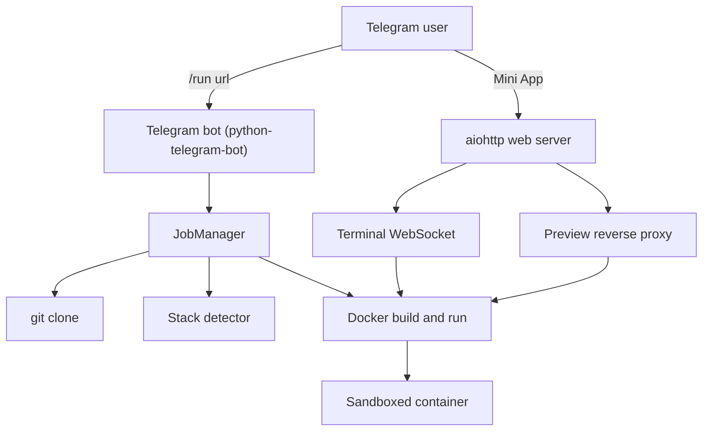
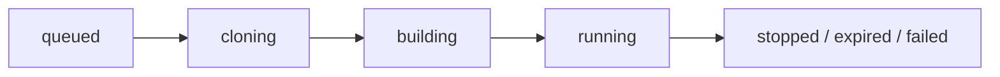

# Telegram GitHub Repo Runner

A self-hosted Telegram bot that takes a GitHub repository, clones it, figures out how to
build and run it, installs the dependencies automatically inside a disposable Docker
sandbox, and gives you back:

- a live **web terminal** into the running container, and
- a **preview link** to the application it started,

both from a **Telegram Mini App**.

It is essentially a tiny self-hosted deployment runner ("send repo, get running app")
driven from Telegram.

> Security first: this tool executes arbitrary code from repositories on your host.
> Read the Security section before exposing it to other people.

## Features

- `/run <github_url> [branch]` clones the repo, detects the stack, builds an image,
  installs dependencies and starts the app in a sandboxed container.
- Automatic detection for Node.js (npm/yarn/pnpm, Next, Vite, CRA, Nuxt), Python
  (Django, Flask, FastAPI, Streamlit, Gradio), Go, Rust, Ruby/Rails, PHP/Laravel,
  Java (Maven/Gradle), static sites and repositories that ship their own `Dockerfile`.
- Per-repo `.tgrunner.yml` override when detection is not enough.
- Telegram Mini App with:
  - new job form and job list,
  - interactive terminal (xterm.js over WebSocket) attached to the container,
  - one-tap preview link, log viewer, and stop button.
- Resource limits per container (memory, CPU, PIDs, no-new-privileges), automatic
  stop after a configurable timeout.
- Access control with `ALLOWED_USER_IDS`, optional repository-owner allowlist, and
  signed Mini App sessions validated with Telegram `initData` HMAC.
- Secrets are redacted from logs and stored messages.

## Architecture



Process flow for one job:



## Repository layout

```text
tgbot/            bot, job manager, detector, docker runner, web server
web/              Telegram Mini App (HTML, CSS, xterm.js)
tests/            unit tests for detector and security
Dockerfile        image for the bot itself
docker-compose.yml
Caddyfile         reverse proxy with automatic HTTPS
```

## Quick start (local, Docker required)

1. Create a bot with [@BotFather](https://t.me/BotFather) and copy the token.

2. Get your numeric Telegram user id (for example from [@userinfobot](https://t.me/userinfobot)).

3. Prepare configuration:

   ```bash
   cp .env.example .env
   python -c "import secrets; print(secrets.token_urlsafe(48))"
   ```

   Set at least `TELEGRAM_BOT_TOKEN`, `SESSION_SECRET` and `ALLOWED_USER_IDS`.

4. Install and run:

   ```bash
   python -m pip install --break-system-packages -r requirements.txt
   python -m tgbot.main
   ```

   The bot needs access to the Docker daemon (`/var/run/docker.sock`).

5. Talk to your bot with `/run https://github.com/owner/repo`.

## Deployment on a VPS

`docker-compose.yml` runs the bot with `network_mode: host` and mounts the Docker
socket so that containers it creates can publish ports on the host loopback.

```bash
docker compose up -d --build
```

Put a TLS reverse proxy in front of the web port. An example `Caddyfile` is included:

```bash
caddy run --config Caddyfile
```

Then set `PUBLIC_URL=https://runner.example.com` in `.env`.

### Preview links

Two modes are supported:

- **Path mode** (default): previews are served at `PUBLIC_URL/preview/<job-id>/`.
  Works with a single domain, but applications that reference absolute asset paths
  (`/assets/...`) may not render correctly through the proxy.
- **Subdomain mode**: set `PREVIEW_BASE_DOMAIN=runner.example.com` and create a
  wildcard DNS record `*.runner.example.com`. Each job then gets
  `https://<job-id>.runner.example.com/`, which works with any application. This
  requires a wildcard TLS certificate (for example via a Caddy DNS challenge).

Telegram requires HTTPS for Mini App buttons, so `PUBLIC_URL` must be `https://...`
for the "Open Mini App" button to appear.

## Bot commands

| Command | Description |
| --- | --- |
| `/run <repo_url> [branch]` | Clone, build and run a repository |
| `/jobs` | List your recent jobs and their status |
| `/status <job_id>` | Details for one job |
| `/logs <job_id>` | Recent build and runtime output |
| `/stop <job_id>` | Stop a running job |
| `/open` | Open the Mini App |
| `/help` | Show help |

## `.tgrunner.yml` override

Add this file to the root of a repository to bypass auto-detection:

```yaml
base_image: node:22-slim
install:
  - npm ci
build:
  - npm run build
run: npm start
port: 3000
```

## Configuration reference

All variables live in `.env.example`. The important ones:

| Variable | Meaning |
| --- | --- |
| `TELEGRAM_BOT_TOKEN` | BotFather token |
| `PUBLIC_URL` | Public HTTPS URL of this service |
| `ALLOWED_USER_IDS` | Comma-separated Telegram user ids allowed to use the bot |
| `ADMIN_USER_IDS` | Users who can manage any job |
| `ALLOWED_REPO_OWNERS` | Optional allowlist of GitHub owners/orgs |
| `GITHUB_TOKEN` | Needed for private repos and higher rate limits |
| `MAX_CONCURRENT_JOBS` | How many jobs may build/run at once |
| `JOB_TIMEOUT_SECONDS` | Auto-stop running jobs after this time |
| `MEM_LIMIT`, `NANO_CPUS`, `PIDS_LIMIT` | Per-container resource limits |
| `ENABLE_TERMINAL` | Enable or disable the web terminal |
| `PREVIEW_BASE_DOMAIN` | Enables subdomain preview links |
| `DEV_LOGIN_USER_ID` | Local development only, never on a public deployment |

## Security

Running repositories from the internet is inherently risky. This project takes these
measures, but they are **not** a complete sandbox:

- Each repo runs in its own container with memory, CPU and PID limits,
  `no-new-privileges`, and no access to the host Docker socket.
- Only `github.com` URLs are accepted; an optional owner allowlist can restrict who
  may be run.
- The Mini App API requires a Telegram `initData` HMAC signature or a signed,
  short-lived session token; the bot itself checks `ALLOWED_USER_IDS`.
- Tokens and obvious secrets are redacted from logs and Telegram messages.

Things you must still do yourself:

- Run this on a dedicated host or VM that you are willing to rebuild.
- Keep `ALLOWED_USER_IDS` non-empty. An open bot lets anyone execute code on your host.
- Consider egress firewall rules so containers cannot reach your private network.
- Do not put secrets or production data on the same host.
- Review untrusted repositories before running them; the detector runs whatever the
  repository asks it to run.

This project is intended for running repositories you trust, on infrastructure you own.
Do not use it to run malware, mine cryptocurrency, or attack third parties.

## Limitations

- Detection is heuristic. Repos that need databases, environment variables, native
  system packages, or a specific build pipeline often need a `.tgrunner.yml`.
- Only public repositories work unless `GITHUB_TOKEN` is configured.
- The path-based preview proxy does not rewrite absolute asset URLs; use
  `PREVIEW_BASE_DOMAIN` for full compatibility.
- Long-running production workloads are out of scope: jobs are stopped after
  `JOB_TIMEOUT_SECONDS` and optionally cleaned up.

## Development

```bash
python -m pip install --break-system-packages -r requirements.txt -r requirements-dev.txt
python -m pytest -q
python -m ruff check tgbot tests
```
